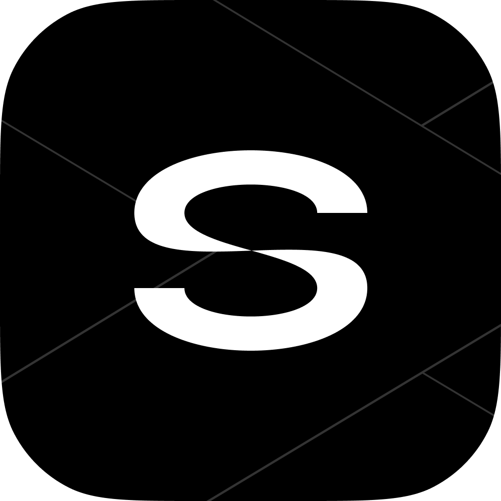

# ☀️ Sunne Roulette

<p align="center">
  
</p>

<h3 align="center">
  Современный и стильный анонимный чат-рулетка для общения в реальном времени
</h3>

<p align="center">
  <a href="https://sunne-cl.github.io/sunne-roulette/"></a>
  <a href="https://sunne-roullete-backend.onrender.com/"></a>
  
</p>

---

## 🌟 Особенности проекта

*   **⚡ Мгновенный поиск:** Быстрый подбор собеседников в реальном времени на основе очереди сокетов.
*   **🎭 Анонимность:** Общайтесь без обязательной сложной регистрации. Задайте имя, загрузите аватарку (хранится локально) и сразу переходите к чату!
*   **🎨 Премиальный дизайн:** Современный футуристичный интерфейс с поддержкой **темной и светлой темы**, плавным скроллом и уникальным шейдерным фильтром пикселизации.
*   **💬 Полноценный чат:** 
    *   Индикатор набора текста («Собеседник печатает...»).
    *   Автоматическая очистка чата при перезапуске.
    *   Оповещения о подключении и отключении участников.
    *   Поддержка отправки сообщений по клавише `Enter`.
*   **📱 Адаптивная верстка:** Удобный интерфейс как для ПК, так и для мобильных устройств.

---

## 🛠️ Стек технологий

*   **Frontend:** HTML5, CSS3 (Vanilla CSS), Modern JavaScript (ES6+), Socket.IO Client.
*   **Backend:** Node.js, Express, Socket.IO Server, TypeScript.
*   **Деплой:** GitHub Pages (Frontend), Render (Backend).

---

## 🚀 Развертывание и запуск бэкенда

### 1-Click Деплой на Render
Чтобы развернуть ваш собственный сервер бэкенда 24/7 бесплатно, просто нажмите кнопку ниже:

[](https://render.com/deploy?repo=https://github.com/sunne-cl/sunne-roulette)

---

## 💻 Локальный запуск (Разработка)

### Бэкенд (Backend)
1. Перейдите в директорию backend:
   ```bash
   cd backend
   ```
2. Установите зависимости:
   ```bash
   npm install
   ```
3. Запустите сервер в режиме разработки:
   ```bash
   npm run dev
   ```
   *Сервер будет запущен на http://localhost:5000.*

### Фронтенд (Frontend)
1. Откройте файл `index.html` в корне проекта в любом браузере или используйте расширение вроде Live Server (VS Code).
2. При запуске на `localhost` или `127.0.0.1` фронтенд автоматически подключится к локальному бэкенду на порту 5000.

---

## 📁 Структура проекта

*   📂 **assets/** — логотипы, звуковые эффекты и шрифты
*   📂 **css/** — кастомные стили оформления
*   📂 **img/** — аватары по умолчанию
*   📂 **js/** — скрипты фронтенда (логика чата, переключение тем)
*   📂 **roullete/** — страница самой чат-рулетки
*   📂 **ts/** — TypeScript исходники фронтенда
*   📂 **backend/** — серверная часть проекта (Node.js + TS + Socket.IO)
    *   📂 **src/** — основной код сервера
    *   📄 **tsconfig.json** — конфигурация TypeScript
    *   📄 **package.json** — зависимости и скрипты бэкенда
*   📄 **render.yaml** — конфигурация автоматического деплоя для Render Blueprint
*   📄 **README.md** — документация проекта

---

## 📄 Лицензия

Этот проект распространяется под лицензией MIT. Подробности см. в файле [LICENSE](LICENSE).
